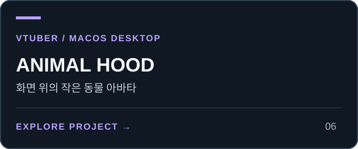
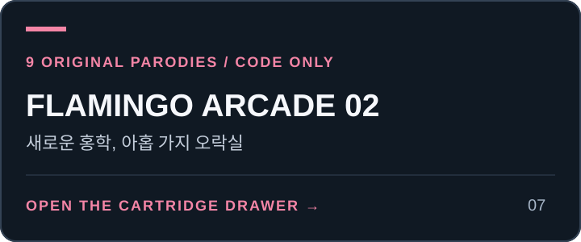

# 🐾 ANIMALVERSE — 동물 메타버스

[](https://minwoo19930301.github.io/animal-metaverse/) [](https://github.com/minwoo19930301/animal-metaverse)

<!-- PROJECT-LINKS:START -->
## 3D Playground

게임·공간·아바타를 한곳에서. 카드를 누르면 저장소로, 아래 버튼을 누르면 공개 데모 또는 실행 안내로 이동합니다.

<table>
<tr>
<td width="50%" valign="top">
<a href="https://github.com/minwoo19930301/seoul-flight-game"></a><br>
<a href="https://minwoo19930301.github.io/seoul-flight-game/"></a>
<a href="https://github.com/minwoo19930301/seoul-flight-game/pulls"></a><br>
<sub>공개 데모는 이전 중심부 · 서울 25구 확장은 최신 PR</sub><br>
<sub><a href="https://github.com/minwoo19930301/seoul-flight-game">저장소</a> · <a href="https://github.com/minwoo19930301/seoul-flight-game/pull/1">병합된 개선 PR #1</a></sub>
</td>
<td width="50%" valign="top">
<a href="https://github.com/minwoo19930301/parking-master-webasm"></a><br>
<a href="https://parking-master-webasm.vercel.app/"></a>
<a href="https://github.com/minwoo19930301/parking-master-webasm/pulls"></a><br>
<sub>공개 데모는 이전 버전 · 최신 소스는 저장소</sub><br>
<sub><a href="https://github.com/minwoo19930301/parking-master-webasm">저장소</a> · <a href="https://github.com/minwoo19930301/parking-master-webasm/pull/2">병합된 개선 PR #2</a></sub>
</td>
</tr>
<tr>
<td width="50%" valign="top">
<a href="https://github.com/minwoo19930301/interior3d"></a><br>
<a href="https://minwoo19930301.github.io/interior3d/"></a>
<a href="https://github.com/minwoo19930301/interior3d/pulls"></a><br>
<sub>공개 데모는 이전 버전 · 19종 모델은 최신 소스</sub><br>
<sub><a href="https://github.com/minwoo19930301/interior3d">저장소</a> · <a href="https://github.com/minwoo19930301/interior3d/pull/1">병합된 개선 PR #1</a></sub>
</td>
<td width="50%" valign="top">
<a href="https://github.com/minwoo19930301/animal-metaverse"></a><br>
<a href="https://minwoo19930301.github.io/animal-metaverse/"></a>
<a href="https://github.com/minwoo19930301/animal-metaverse/pulls"></a><br>
<sub>3D 3종 + 2D 3종 · 아래에서 바로 선택</sub><br>
<sub><a href="https://github.com/minwoo19930301/animal-metaverse">저장소</a> · <a href="https://github.com/minwoo19930301/animal-metaverse/pull/1">병합된 개선 PR #1</a></sub>
</td>
</tr>
<tr>
<td width="50%" valign="top">
<a href="https://github.com/minwoo19930301/flamingo-chess"></a><br>
<a href="https://minwoo19930301.github.io/flamingo-chess/"></a>
<a href="https://github.com/minwoo19930301/flamingo-chess/pulls"></a><br>
<sub>플라밍고 vs 흑조 · AI 대국</sub><br>
<sub><a href="https://github.com/minwoo19930301/flamingo-chess">저장소</a> · <a href="https://github.com/minwoo19930301/flamingo-chess/pull/1">병합된 개선 PR #1</a></sub>
</td>
<td width="50%" valign="top">
<a href="https://github.com/minwoo19930301/animal-hood-girl-vtuber"></a><br>
<a href="https://github.com/minwoo19930301/animal-hood-girl-vtuber#실행"></a>
<a href="https://github.com/minwoo19930301/animal-hood-girl-vtuber/pulls"></a><br>
<sub>macOS 로컬 앱 · 웹 플레이 링크 없음</sub><br>
<sub><a href="https://github.com/minwoo19930301/animal-hood-girl-vtuber">저장소</a> · <a href="https://github.com/minwoo19930301/animal-hood-girl-vtuber/pull/1">병합된 개선 PR #1</a></sub>
</td>
</tr>
<tr>
<td width="50%" valign="top">
<a href="https://github.com/minwoo19930301/flamingo-arcade-2"></a><br>
<a href="https://github.com/minwoo19930301/flamingo-arcade-2#로컬에서-실행"></a>
<a href="https://github.com/minwoo19930301/flamingo-arcade-2"></a><br>
<sub>2D 패러디 8종 + 로우폴리 3D 대전 · 코드만 공개, 미배포</sub>
</td>
<td width="50%" valign="top">
<h3>두 번째 플라밍고 게임 서랍</h3>
<p>라면 · 부적 · 전대 · 철거 · 가상 바탕화면 · 폐차 · 흑백 격투 · 로켓슛 · 장외 대전</p>
<a href="https://github.com/minwoo19930301/flamingo-arcade-2#카트리지-서랍"></a>
<a href="https://github.com/minwoo19930301/flamingo-arcade-2/blob/main/docs/visual-references.md"></a>
</td>
</tr>
</table>

### ANIMALVERSE · 여섯 세계 바로가기

<p>
<a href="https://minwoo19930301.github.io/animal-metaverse/versions/3d/"></a>
<a href="https://minwoo19930301.github.io/animal-metaverse/versions/3d-r3f/"></a>
<a href="https://minwoo19930301.github.io/animal-metaverse/versions/3d-babylon/"></a>
<a href="https://minwoo19930301.github.io/animal-metaverse/versions/2d-pixel/"></a>
<a href="https://minwoo19930301.github.io/animal-metaverse/versions/2d-pastel/"></a>
<a href="https://minwoo19930301.github.io/animal-metaverse/versions/2d-iso/"></a>
</p>

<sub>2026-09-07 확인: 공개 데모 5곳과 ANIMALVERSE 세부 경로 6곳은 HTTP 응답 확인. 화면·조작 검증을 뜻하지 않습니다. 위 개선 PR 6개는 병합됐습니다. Interior3D 공개 데모는 이전 배포이며, Driving Practice 공개 데모의 최신 확장 반영도 확인되지 않았습니다. “최신 PR”에는 병합 전 변경이 포함될 수 있습니다.</sub>

<!-- PROJECT-LINKS:END -->

동물 친구들로 가득 찬 브라우저 메타버스. **같은 세계·같은 캐릭터**를 서로 다른 6가지 아트 스타일로 구현해, 마음에 드는 디자인 방향을 비교해 볼 수 있습니다.

모든 그래픽은 외부 이미지 에셋 없이 **코드로 직접** 그렸습니다.

## 🎨 6가지 버전 (3D 3종 + 2D 3종)

| 버전 | 스타일 | 경로 |
|---|---|---|
| 🌍 로우폴리 아일랜드 | **3D** · Three.js 로우폴리, 3인칭 추적 카메라 | `versions/3d/` |
| 🌇 노을 군도 | **3D** · 동화책 셀셰이딩(3단 톤 + 잉크 외곽선), 노을 배경 | `versions/3d-r3f/` |
| ✨ 토이 아일랜드 | **3D** · 캔디 토이 룩 (막대사탕 나무·캔디 가로등·광택 재질) | `versions/3d-babylon/` |
| 🕹️ 도트 빌리지 | **2D** · 레트로 16비트 픽셀 탑다운 RPG | `versions/2d-pixel/` |
| 🌸 파스텔 파크 | **2D** · 말랑한 파스텔 벡터, 치비 비율 | `versions/2d-pastel/` |
| 🏝️ 아이소 디오라마 | **2D** · 아이소메트릭 미니어처 디오라마 | `versions/2d-iso/` |

세 3D 버전은 서로 다른 엔진과 아트 디렉션으로 **같은 섬 월드**를 구현해 비교할 수 있습니다: 로우폴리(Three.js) / 동화책 셀셰이딩(R3F) / 캔디 토이(Babylon). R3F 버전은 Three.js 버전의 `versions/3d/js/animals.js`(동물 모델 빌더)를 그대로 재사용하고, Babylon 버전은 `build{}` 힌트 기반 자체 프로시저럴 빌더를 씁니다.

## 🦩 캐릭터

- **선택 가능 동물 20종** (`shared/characters.js`): 플라밍고 · 토끼 · 여우 · 판다 · 치즈 고양이 · 시바견 · 펭귄 · 부엉이 · 사자 · 호랑이 · 코끼리 · 기린 · 원숭이 · 개구리 · 거북이 · 곰 · 돼지 · 병아리 · 고슴도치 · 수달
- **마을 NPC 8명** (`shared/npcs.js`): 카피바라(온천 지킴이) · 비둘기(우체부) · 알파카(카페 사장) · 라쿤(잡화점 주인) · 염소(정원사) · 앵무새(안내원) · 나무늘보(벤치 철학자) · 우파루파(낚시터 지킴이)
- **월드 존 5곳**: 중앙 광장 · 벚꽃 공원 · 반짝 호수 · 카페 거리 · 온천 마을

## 🎮 조작

- 이동: `WASD` / 방향키
- NPC 대화: 가까이 가서 `E`
- 3D 모바일: 화면 왼쪽 방향 버튼으로 이동, 오른쪽 `대화 / 다음` 버튼으로 NPC와 대화

3D 세 버전은 한글 입력 상태에서도 물리적인 WASD 키로 움직입니다. 이동 방향을
바꾸어도 카메라의 방위는 고정되어 옆걸음/뒷걸음이 회전으로 바뀌지 않습니다.
포커스를 잃거나 터치가 취소되면 이동이 멈추며, E를 길게 눌러도 대사를 건너뛰지 않습니다.

## ▶️ 실행

```bash
python3 -m http.server 8000
# 브라우저에서 http://localhost:8000 접속
```

2D 버전들은 `index.html` 을 바로 열어도 동작하지만, 3D 버전은 ES 모듈(CDN) 을 쓰므로 로컬 서버가 필요합니다.

## 📁 구조

```
index.html           # 버전 선택 랜딩 페이지
shared/
  characters.js      # 선택 가능 동물 20종 (팔레트·형태 힌트·소개말)
  npcs.js            # NPC 8명 + 월드 존 정의 (대사 포함)
  controls.js        # 3D 공통 키보드·터치 입력과 포커스 처리
  controls.css       # 모바일 캐릭터 선택과 방향 버튼
versions/
  3d/                # Three.js 로우폴리
  3d-r3f/            # React Three Fiber 동화책
  3d-babylon/        # Babylon.js 캔디 토이
  2d-pixel/          # 픽셀 RPG
  2d-pastel/         # 파스텔 벡터
  2d-iso/            # 아이소메트릭
```

## 3D 회귀 검증

```bash
npm ci
npx playwright install chromium
npm test
# 설치된 Chrome을 쓰려면: CHROME_CHANNEL=chrome npm test
```

테스트가 로컬 서버를 열고 세 3D 버전에서 20종 캐릭터 선택, 모바일 입장,
직선 이동, 한글 키보드, 포커스/터치 취소, NPC 대화, 지역 표시를 확인합니다.
Babylon의 공유 재질과 Retina 이름표 위치도 검사합니다. CDN 접근이 필요하며
모바일·데스크톱 스크린샷은 `test-results/`에 저장됩니다.

각 3D 주소에 `?debug=1`을 붙이면 `window.__avDebug.state()`에서 플레이어/NPC
좌표와 입력 상태를 읽을 수 있습니다. 이 옵션이 없으면 진단 객체는 만들지 않습니다.
